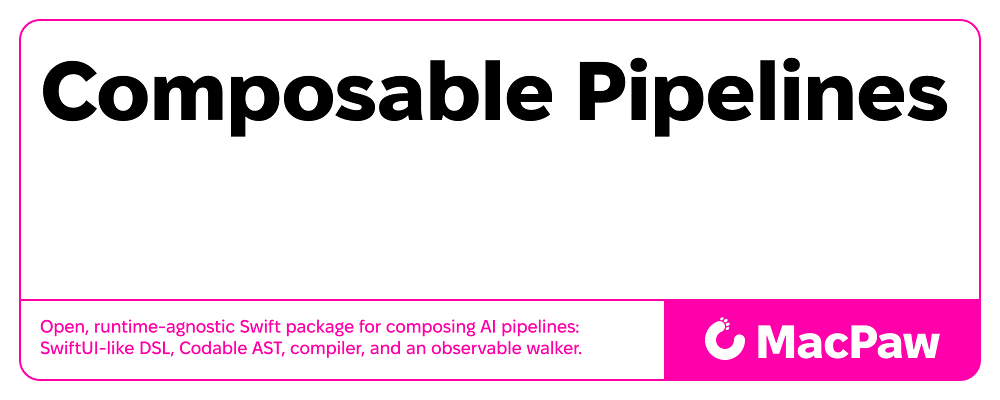
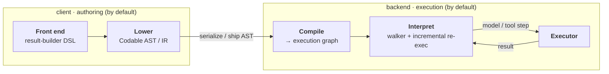
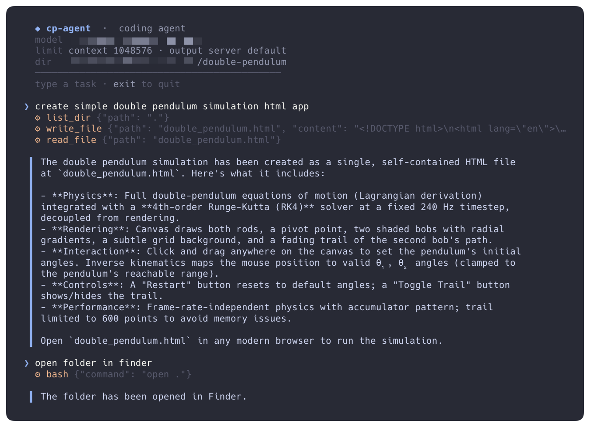

# Composable Pipelines




**An intermediate representation and compiler for AI pipelines in Swift.**

Composable Pipelines separates an AI pipeline into three layers with well-defined boundaries: a
declarative *front end* (result-builder surface syntax), a serializable *representation* (a
`Codable` AST that serves as the intermediate representation), and a pluggable *backend*
(execution). You author a pipeline declaratively; it **lowers** to the IR; a **compiler** analyzes
the data dependencies and emits an execution graph; and an observable interpreter — the **walker**
— runs that graph with incremental, epoch-based re-execution, delegating every model and tool step
to a backend you supply through a single `Executor` interface.

The same primitives scale from a two-step summary to a full **tool-calling agent**: loops, tools,
and branching are ordinary pipeline constructs. See the
[coding-agent worked example](#worked-example-a-coding-agent-as-a-pipeline) — a real agent built
entirely on this DSL.

```swift
import ComposablePipelines

struct Summary: Pipeline {
    typealias Output = String
    let document: String

    @State var keyPoints = ""
    @State var summary = ""

    var body: some Pipeline {
        $keyPoints.set {                                   // step 1 → slot
            Model<String>()
                .systemPrompt("Extract the 5 key points.")
                .message(document)
        }
        $summary.set {                                     // step 2 reads step 1
            Model<String>()
                .systemPrompt("Write a concise summary from these points.")
                .input { $keyPoints.get() }
        }
        $summary.get()                                     // pipeline output
    }
}
```

No manual graph wiring, no callback pyramids: dependencies between steps are inferred from the
`@State` slots they read and write.

Branch on a model's output with **native control flow** — the graph re-evaluates once the value
lands:

```swift
struct Triage: Pipeline {
    typealias Output = String
    let ticket: String

    @State var severity = ""
    @State var reply = ""

    var body: some Pipeline {
        $severity.set {                                    // classify
            Model<String>().systemPrompt("Reply 'high' or 'low'.").message(ticket)
        }
        if severity == "high" {                            // native `if`, re-evaluated on the result
            $reply.set { Model<String>().systemPrompt("Draft an urgent reply.").message(ticket) }
        } else {
            $reply.set("Queued for standard handling.")    // a plain value is a step, too
        }
        $reply.get()                                       // pipeline output
    }
}
```

→ More patterns in the [examples guide](docs/examples.md): retrieval, map-reduce (`ForEach`),
model-tier routing, a self-healing retry loop, and a tool-calling agent.

## How it works



Three separable stages. **Lowering** turns the declarative body into a `Codable` AST — the
intermediate representation. **Compilation** analyzes the data dependencies between `@State` slots
and emits an execution graph, parallelizing independent steps. **Interpretation** walks that graph:
the walker owns ordering, parallelism, state, and epoch-based incremental re-execution, while the
`Executor` backend owns *how a step runs*.

The `Codable` AST is the natural **client/backend boundary**: authoring and lowering typically run
on a client, and everything after the AST — compilation, interpretation, and execution — on a
backend that decodes it. But that boundary is a deployment choice, not a rule: run every stage in
one process, or place the split wherever suits you. The layers never leak into each other; the AST
is the contract between them.

Composable Pipelines is the open authoring, IR, and compiler layer of **Elix**, MacPaw's
proprietary AI engine. Elix supplies a production `Executor` backend for these pipelines;
everything in this repository is the layer *above* that proprietary execution. For the design and
rationale, see the technical note
[**Composable AI Pipelines**](https://research.macpaw.com/publications/composable-ai-pipelines).

## Why

- **Declarative front end, inferred graph.** Author with `@PipelineBuilder`, `@State`, and native
  `if`/`switch`; the execution graph is derived from the data dependencies between state slots, not
  wired by hand.
- **Bring your own runtime.** The walker never runs a model itself; it calls an `Executor` you
  implement — a local model, a hosted API, a remote service, anything. `MockExecutor` ships for
  tests, and a Foundation-only `OpenAIChatExecutor` talks to any OpenAI-compatible endpoint.
- **The AST is the wire format — and the client/backend seam.** A pipeline lowers to a `Codable`
  AST on the client; a backend decodes it, compiles, and runs it. Everything after AST generation
  is the backend's job by default — though you're free to place the split anywhere, or run it all
  in one process. The same pipeline crosses the wire either way.
- **Incremental re-execution.** State writes advance an epoch; on re-evaluation the walker skips
  the unchanged graph prefix instead of re-running completed work — which is what makes reactive
  `While` loops and value-dependent branching cheap.
- **Dependency-light.** Resolves on Foundation and swift-syntax. No proprietary dependencies.

## Install

```swift
.package(url: "https://github.com/MacPaw/ComposablePipelines", from: "0.1.0")
```

The umbrella product re-exports the whole stack:

```swift
.target(name: "MyApp", dependencies: [
    .product(name: "ComposablePipelines", package: "ComposablePipelines"),
])
```

```swift
import ComposablePipelines   // one import: DSL + AST + compiler + walker
```

Prefer narrower imports? Depend on the individual products instead — `PipelineAST`,
`PipelineDSL`, `PipelineCompiler`, `ExecutionEngine`. Requires a Swift 6.1+ toolchain; runs on
macOS 14+, iOS 17+, and Linux.

## Run it end to end

The walker delegates each model/guardrail step to your `Executor`:

```swift
import ComposablePipelines

struct EchoExecutor: Executor {
    func runModel(
        config: ModelConfig,
        arguments: ModelArguments,
        onDelta: (@Sendable (String) -> Void)?
    ) async throws -> ExecutionValue {
        let system = arguments.systemPrompt
        let text: String
        if case .string(let message)? = arguments.message { text = message } else { text = "" }
        return try JSONEncoder().encode("[\(system)] \(text)")   // call a real model here
    }
}

let pipeline = Summary(document: "…")
let graph    = PipelineCompiler().compile(pipeline.loweredGraph())
let walker   = PipelineWalker(executor: EchoExecutor())

let result = try await walker.run(graph: graph) { event in
    print(event)            // observe step lifecycle, state updates, progress
}
print(try JSONDecoder().decode(String.self, from: result))
```

`MockExecutor` ships so the package runs out of the box — model steps return an empty placeholder
and guardrails pass, enough to exercise graph shape in demos and tests.

### Against a real model

`OpenAIChatExecutor` (Foundation-only) talks to any OpenAI-compatible endpoint. The bundled
`cp-demo` executable runs a three-step **draft → revise → polish** pipeline on a topic you pass in
— compile, walk, stream the step/state events to stderr, print the finished paragraph. It's
configured entirely through environment variables:

| Variable | Required | Default | Notes |
| --- | --- | --- | --- |
| `OPENAI_API_KEY` | yes | — | Any non-empty value. Local servers usually ignore it — pass `x`. |
| `OPENAI_BASE_URL` | no | `https://api.openai.com/v1` | Any OpenAI-compatible endpoint. |
| `OPENAI_MODEL` | no | `gpt-4o-mini` | Model id the endpoint serves. |

```bash
# OpenAI
export OPENAI_API_KEY=sk-...
swift run cp-demo "Swift result builders"

# Any OpenAI-compatible endpoint — local or remote (Ollama, LM Studio, mlx-lm, vLLM, …).
# Pass a throwaway key for servers that don't require auth.
OPENAI_API_KEY=x OPENAI_BASE_URL=http://localhost:1977/v1 OPENAI_MODEL=your-model \
  swift run cp-demo "Swift result builders"
```

> **Output limits.** By default the executor sends no `max_tokens`, letting the server use its own
> limit (usually the model's full output) — so large single-turn writes aren't truncated. If your
> server has a low default output cap and cuts replies short (common with reasoning models on some
> local servers), set `OPENAI_MAX_OUTPUT_TOKENS`. The context window is discovered from the API,
> `OPENAI_CONTEXT_TOKENS`, or a known-model default.

## Worked example: a coding agent as a pipeline

The DSL isn't only for linear flows. `cp-agent` is a real, tool-using coding agent — read, list,
search, write, edit files and run `bash` — with a dark, interactive terminal chat UI. The entire
agent loop *is* a pipeline, and it's a compact tour of how you engineer non-trivial pipelines.



```bash
OPENAI_API_KEY=x OPENAI_BASE_URL=http://localhost:1977/v1 OPENAI_MODEL=your-local-model \
  swift run cp-agent ./scratch-dir
```

Here is the shape of the loop (abridged — the shipped
[`CodingAgentPipeline`](CodingAgent/CodingAgentPipeline.swift) adds context compaction, stall
recovery, and window-aware budgeting):

```swift
struct CodingAgentPipeline: Pipeline {
    typealias Output = String
    let task: String
    let tools: [any ModelTool]

    @State var transcript: String
    @State var lastTurn = ModelTurn()
    @State var reply = ""
    @State var turns = 0

    var body: some Pipeline {
        // The agent loop is a reactive While: it re-reads committed state each iteration.
        While(condition: { reply.isEmpty && turns < maxTurns }) {
            // 1. Ask the model, advertising the available tools.
            $lastTurn.set {
                Model<ModelTurn>()
                    .tools(tools.map(\.descriptor))
                    .systemPrompt(systemPrompt)
                    .input { $transcript.get() }
            }
            // 2. Run whatever tools the model called; append the results to the transcript.
            $transcript.set {
                ClientTask(input: $lastTurn) { turn in
                    guard let calls = turn.toolCalls, !calls.isEmpty else { return transcript }
                    var updated = transcript
                    for call in calls {
                        let output = try await ToolRegistry(tools).executeJSON(
                            toolName: call.name, inputJSON: Data(call.arguments.utf8))
                        updated += "\n[\(call.name)] " + String(decoding: output, as: UTF8.self)
                    }
                    return updated
                }
            }
            // 3. A turn with tool calls keeps looping; a tool-free turn is the final answer.
            $reply.set {
                ClientTask(input: $lastTurn) { turn in
                    (turn.toolCalls?.isEmpty == false) ? "" : (turn.reply ?? "")
                }
            }
            $turns.set { ClientTask(input: $turns) { $0 + 1 } }
        }
        $reply.get()
    }
}
```

**What this teaches about engineering pipelines:**

- **A loop is a primitive, not a special case.** The agent's turn loop is a `While` whose condition
  reads ordinary `@State`. Because state writes advance epochs, the walker re-lowers and re-runs
  only what changed each iteration — no bespoke agent runtime required.
- **Tools are client work, expressed as `ClientTask`.** The model returns a `ModelTurn` carrying
  `toolCalls`; a `ClientTask` dispatches them through a `ToolRegistry` and folds the results back
  into state. Model steps and client steps compose in the same graph.
- **Client-side vs. host-side tools.** The file/`bash` tools are `ModelTool`s — locally executed
  through the registry. The framework also models `AgentTool`s — descriptor-only tools a host
  runtime executes — so the same pipeline can target a local process or a remote agent.
- **Cross-cutting concerns are sub-pipelines.** When the transcript approaches the model's context
  window, a compaction *sub-pipeline* summarizes the older middle and rewrites state in place —
  composed into the loop, not bolted onto it.
- **Swap the whole agent behind a protocol.** The terminal UI depends only on a `ChatAgent`
  ([`ChatAgent`](CodingAgent/ChatAgent.swift)); `CodingAgentAdapter` wires this pipeline behind it,
  so another model or a remote service is a drop-in replacement.
- **Reactive runs have one entry point.** [`PipelineRunner`](ComposablePipelines/PipelineRunner.swift)
  drives any `While`/branching pipeline — re-lowering and recompiling as committed state evolves.

> **Safety:** file tools are confined to the working directory (path-escape and symlink traversal
> are rejected). `bash` is an escape hatch — it runs with the directory as its cwd but is not
> otherwise sandboxed, so point the agent at a scratch directory and a model you trust.

## Build pipelines with your AI agent

An agent **skill** aggregates the API, patterns, and common pitfalls of building pipelines, so your
AI coding agent authors and debugs them correctly. Install it for the major agents:

```bash
curl -fsSL https://raw.githubusercontent.com/MacPaw/ComposablePipelines/main/.claude/skills/install.sh | sh
```

The script installs every bundled skill into the skill directory of each supported agent it finds
(Claude Code, Codex, opencode, Gemini CLI, Copilot CLI); set `SKILL_DIRS` to choose destinations.
Each skill activates automatically when you work in a project that uses ComposablePipelines. Source:
[`.claude/skills/`](.claude/skills/).

## Documentation

- [Getting started](docs/getting-started.md) — install, your first pipeline, compile + walk.
- [Primitives](docs/primitives.md) — `Model`, `Guardrail`, `While`, `Group`, `ForEach`,
  `Summarize`, `ClientTask`, `@State`, and native control flow, with examples.
- [Executors](docs/executors.md) — the `Executor` seam in depth: `ExecutionValue` encoding,
  observation, errors and fallbacks.
- [Architecture](docs/architecture.md) — AST → compiler → walker, epochs and incremental
  re-execution, and the wire-format AST.
- [Examples](docs/examples.md) — a guided tour of the runnable reference pipelines: sequential flow,
  parallel fan-out, map-reduce (`ForEach`), model-output branching, retrieval (`From`), a
  self-healing retry loop, and a tool-calling agent loop. (Source in [`Examples/`](Examples/).)
- [Technical note](https://research.macpaw.com/publications/composable-ai-pipelines) — the design
  and rationale behind Composable AI Pipelines.

## License

Apache License 2.0 — © MacPaw Inc. See [LICENSE](LICENSE) and [NOTICE](NOTICE).

## A note on this repository

This repository is a read-only **mirror**: changes are made upstream and exported here, so code
is not edited directly in this repo. Please read [CONTRIBUTING.md](CONTRIBUTING.md) before opening
issues or pull requests.
